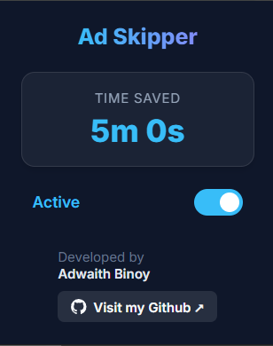

# Youtube😎 - Ad Skipper Extension

  

A lightweight, modern Google Chrome extension that automatically skips and fast-forwards YouTube ads. 

It also keeps track of how much total time of your life it has saved you! ⏱️

## Features
- **Auto-Skipping**: Instantly clicks the "Skip Ad" button the millisecond it appears.
- **Fast-Forwarding**: If an ad is unskippable, the extension automatically mutes the video and fast-forwards it at 16x speed to the very end.
- **Time Saved Tracker**: Calculates exactly how much time you've saved and displays it in a sleek popup.
- **Toggle Switch**: Easily turn the adblocker on or off via the extension popup.

## Installation (Developer Mode)

1. Clone or download this repository to your local machine.
2. Open Google Chrome and navigate to `chrome://extensions/`.
3. Turn on **Developer mode** in the top right corner.
4. Click the **Load unpacked** button in the top left.
5. Select the folder containing this repository's files.
6. Enjoy ad-free YouTube!

## Developed By
[Adwaith Binoy](https://github.com/adwaith5354-hub)
